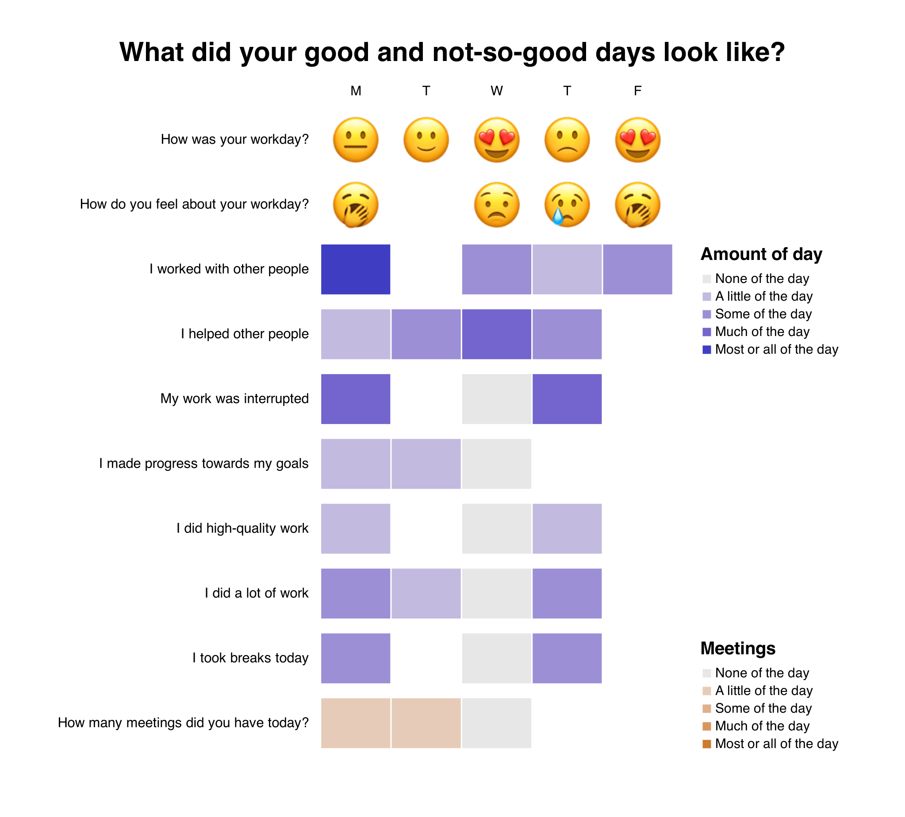

# Good Day Slack Bot

Good Day is a Slack bot that pings users every day and asks how their day was. It saves the results in a GitHub repository of the user's choice, within a `good-day.csv` file in the repo. Check out this [sample repo](https://github.com/githubocto/good-day-demo) for a preview of what yours could look like. 


It also provides a series of visualizations to help users understand their data over time.



## How it Works


### Slack App Express server

The repo contains the code for the core Good Day Slack bot, which is a Slack server that performs a few functions:

1. Stores a user's GitHub repo and time preference in a database by collecting info from the Slack app home panel.
2. Messages a user every day on the time they have specified with a new Good Day form.
3. Stores user's daily data into a `good-day.csv` file in the repo of their choice.
4. Messages a user every week when new visualization charts have been generated from their data.

**⚠️ A note about privacy ⚠️**

Once a user creates a GitHub repository they have to invite the `good-day-bot` [GitHub user](https://github.com/good-day-bot) as a collaborator to the repo. This GitHub account (and by extension this Slack app) has write access to ___only this one particular user repo___. This means we are NOT asking for or storing any GitHub user authentication data.


### Azure functions

This Slack Bot depends on two Azure functions: [https://github.com/githubocto/good-day-azure](https://github.com/githubocto/good-day-azure)

1. **Timed Notify**: This function runs every hour, checks the database for users who need a new form, and hits an endpoint on the express server to trigger a new Good Day form for users daily.
2. **Generate Charts**: This function runs every week and generates visualization charts for users in their GitHub repos. It also hits an endpoint on the express server to notify users new charts are ready.

## Development

### Local setup

1. Install ngrok and authenticate

2. Create a `.env` file with:

```
GH_API_KEY=
SLACK_SIGNING_SECRET=
SLACK_BOT_TOKEN=
PG_CONN_STRING=
AZURE_FUNCTIONS_ID= # API Key ID for azure functions
AZURE_FUNCTIONS_SECRET= # API Key secret for azure functions
```

3. Start the server and ngrok

`yarn install`

`yarn dev`

In a new tab: `ngrok http 3000 --hostname octo-devex.ngrok.io`

### Slack app configuration

1. Enable interactivity and change the endpoint for interactive messages at: [interactivity and shortcuts](https://api.slack.com/apps/A0212TEULJU/interactive-messages?) to `https://octo-devex.ngrok.io/interactive`

2. Enable events and change the endpoint for events at: [event subscriptions](https://api.slack.com/apps/A0212TEULJU/event-subscriptions?) to `https://octo-devex.ngrok.io/events`

## Building / Releasing

### Deployment

Deployment to the production app happens automatically when pushing to main by using a GitHub Action specified in `.github/workflows/main_octo-good-day-bot.yaml`.

Or use the [Azure App Service VS Code Extension](https://marketplace.visualstudio.com/items?itemName=ms-azuretools.vscode-azureappservice) for dev testing work.

### Slack app configuration

1. Enable interactivity and change the endpoint for interactive messages at: [interactivity and shortcuts](https://api.slack.com/apps/A0212TEULJU/interactive-messages?) to `PRODUCTION_URL/interactive`

2. Enable events and change the endpoint for events at: [event subscriptions](https://api.slack.com/apps/A0212TEULJU/event-subscriptions?) to `PRODUCTION_URL/events`

3. Add the following Bot Token Scopes at: [oauth and permissions](https://api.slack.com/apps/A0212TEULJU/oauth?) `chat:write`, `files:write`, `im:write`, `incoming-webhook`, `users:read`

## License

[MIT](LICENSE)
